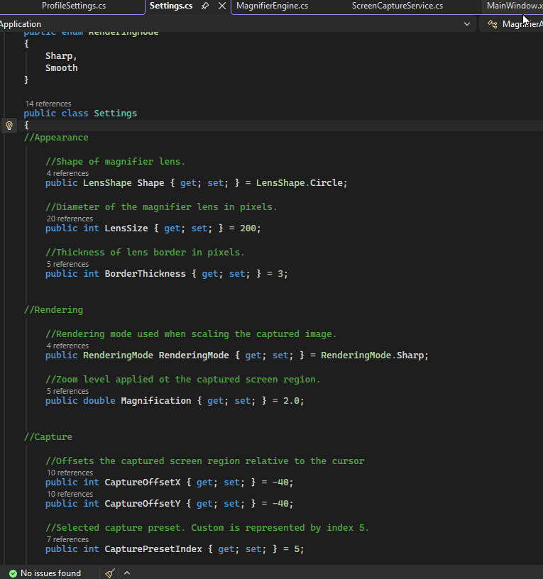
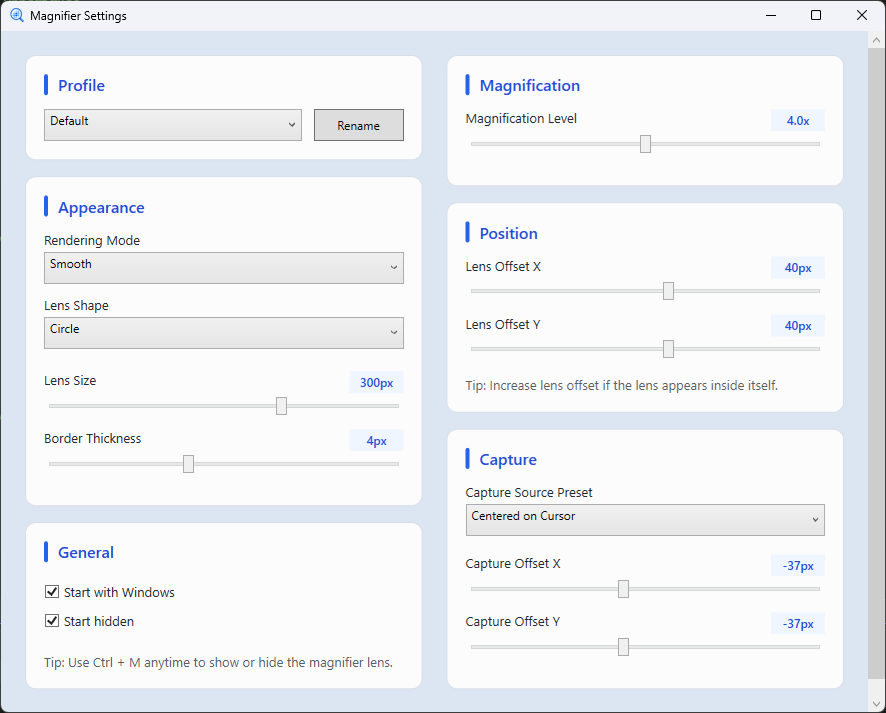

# Magnifier Application

A lightweight Windows desktop magnifier that provides localized zoom near the cursor without changing system-wide display scaling.

Built with C# and WPF, Magnifier Application captures a configurable region near the mouse and displays it in a movable magnification lens. It is designed to run as a small background utility with persistent settings, profiles, tray controls, and a global keyboard shortcut.



## Features

- Real-time magnification that follows the cursor
- Circular and square lens shapes
- Adjustable magnification and lens size
- Configurable capture and window offsets
- Capture offset presets that scale with the current zoom configuration
- Sharp and Smooth rendering modes
- Multiple configurable profiles
- Persistent settings between sessions
- Global `Ctrl + M` shortcut to show or hide the magnifier
- System tray controls for:
  - Showing or hiding the magnifier
  - Opening Settings
  - Exiting the application
- Optional launch with Windows
- Optional start-hidden behavior
- Lightweight background operation

## Settings

The Settings window provides control over the magnifier without requiring configuration files or code changes.



Settings include:

- Profile selection and naming
- Magnification level
- Lens size
- Lens shape
- Rendering mode
- Capture offset
- Window offset
- Capture offset presets
- Start Hidden
- Start with Windows

Settings are saved automatically and restored the next time the application is launched.

## Download and Installation

A prebuilt Windows version is available from the **Releases** section of this repository.

1. Download the latest `MagnifierApplication-v1.0-win-x64.zip`.
2. Extract the entire ZIP to a folder of your choice.
3. Run `MagnifierApplication.exe`.

The application is published as a self-contained Windows x64 build, so a separate .NET installation is not required.

> Keep the contents of the extracted folder together. The executable relies on files included alongside it in the release package.

### Optional Shortcut

To create a desktop shortcut:

1. Right-click `MagnifierApplication.exe`.
2. Select **Show more options** if necessary.
3. Choose **Send to → Desktop (create shortcut)**.

## Usage

Launch `MagnifierApplication.exe` to start the magnifier.

By default, the magnifier appears immediately when the application starts.

### Global Shortcut

Press `Ctrl + M` to toggle the magnifier on or off from anywhere in Windows.

### System Tray

While running, Magnifier Application places an icon in the Windows system tray.

Right-click the tray icon to:

- Open Settings
- Show or hide the magnifier
- Exit the application

Double-clicking the tray icon also opens Settings.

### Start Hidden

When **Start Hidden** is enabled, manually launching the application starts it in the system tray without immediately displaying the magnifier.

### Start with Windows

When **Start with Windows** is enabled, Magnifier Application launches automatically when the current Windows user signs in.

Windows startup launches the application hidden so it can remain available from the tray or through `Ctrl + M` without displaying the lens every time the computer starts.

## Profiles

Multiple magnifier profiles can be created for different use cases.

Each profile stores its own magnifier configuration, allowing settings such as magnification, lens size, shape, rendering mode, and offsets to be changed without repeatedly reconfiguring the application.

Profiles can also be renamed from the Settings window.

## Rendering Modes

Magnifier Application includes two rendering options.

### Sharp

Uses nearest-neighbor scaling to preserve hard pixel edges.

This can work well for text, UI elements, pixel art, and other content where maintaining crisp boundaries is useful.

### Smooth

Uses higher-quality interpolation to produce a softer scaled image.

This can work better for photographs, video, and other content where smoother enlargement is preferred.

## How It Works

The application captures a small region of the desktop near the current cursor position, enlarges that image, and displays the result inside a WPF overlay window.

The main update loop handles:

1. Reading the current cursor position
2. Determining the configured capture region
3. Capturing that section of the screen
4. Scaling the captured image using the selected rendering mode
5. Updating the magnifier lens
6. Positioning the lens relative to the cursor

Capture presets are calculated relative to the current lens size and magnification so their behavior remains useful as the zoom configuration changes.

The application also integrates with Windows for global hotkeys, system tray behavior, and optional startup registration.

## Technologies

- C#
- .NET
- Windows Presentation Foundation (WPF)
- GDI+ screen capture
- Win32 global hotkeys
- Windows Registry startup integration
- JSON settings persistence

## Project Structure

The application is divided into focused components for UI, rendering, capture, settings, and Windows integration.

Key areas include:

- **Magnifier Engine** – coordinates frame capture and rendering
- **Screen Capture Service** – captures the configured desktop region
- **Magnifier Renderer** – scales captured frames using the selected rendering mode
- **Cursor Service** – provides cursor positioning
- **Hotkey Service** – registers and manages the global toggle shortcut
- **Settings Storage Service** – loads and saves application settings
- **Startup Service** – manages optional Windows startup registration
- **Settings Window** – provides the user-facing configuration interface

## Building from Source

### Requirements

- Windows
- Visual Studio with .NET desktop development support
- A compatible .NET SDK

Clone the repository:

```bash
git clone https://github.com/billycook71/Magnifier-Application.git
```

Open the solution in Visual Studio and build or run the project normally.

For distribution, the current release build is published as:

- `Release`
- `win-x64`
- Self-contained
- Folder-based deployment

## Known Limitations

- Magnification is performed through desktop screen capture rather than a GPU-native capture pipeline.
- Very small capture offsets can allow the magnifier to capture part of its own lens depending on the selected configuration.
- The application currently targets Windows only.

If the lens begins appearing inside itself, increasing the capture offset will move the sampled area farther away from the displayed lens.

## Future Ideas

The current version is intended to remain focused on lightweight localized magnification, but possible future improvements include:

- Additional lens appearance customization
- Border color options for improved visibility against different backgrounds
- Additional rendering or performance controls
- Expanded accessibility features
- OCR-based text recognition and text-to-speech support

Future changes will be driven primarily by actual usage, feedback, and accessibility value rather than adding features solely for complexity.

## Why I Built It

I originally created this application because I wanted an easy way to enlarge small text and interface elements on a high-resolution display without changing Windows display scaling for the entire desktop.

The project grew from a basic magnification prototype into a complete Windows utility and gave me practical experience with desktop application architecture, real-time rendering, screen capture, persistent configuration, Windows APIs, application lifecycle management, and packaging a C# application for distribution.
